# Architecture

This document describes the system design and data flow of PokerSimulator.

## High-Level Overview

```mermaid
sequenceDiagram
    autonumber
    participant U as 👤 User (React)
    participant B as ⚡ Backend (FastAPI)
    participant D as 📚 ChromaDB (RAG)
    participant A as 🤖 PokerAgent
    participant G as ✨ Gemini 2.0
    participant E as ⚙️ PyPokerEngine

    Note over U,B: Turn Start
    U->>B: POST /play-turn (Game State)
    B->>A: Activate Agent
    
    rect rgb(240, 248, 255)
        Note right of A: Decision Phase
        A->>D: Retrieve similar hands
        D-->>A: Context (Historical Data)
        A->>G: Prompt (State + Context)
        G-->>A: Suggested Move
    end
    
    A->>E: Validate & Execute Move
    E-->>B: Updated Game State
    B-->>U: JSON Response (New State)
```



## Components

### Frontend

- **Tech:** React 19, Vite 7, Tailwind CSS, Axios
- **Role:** UI for poker table, player actions, game state display
- **Status:** Scaffold in place; game UI to be built

### Backend (FastAPI)

- **API Layer:** REST endpoints for health check and turn execution
- **PokerAgent:** Wraps Gemini 2.0 Flash; receives game state + RAG context, returns JSON decision
- **Planned Flow:** `/play-turn` → RAG retrieval → Agent → response to frontend

### RAG Pipeline

1. **Ingest (`ingestBooks.py`):**
   - Load `.txt` files from `data/{pro_name}/`
   - Chunk with `RecursiveCharacterTextSplitter` (1000 chars, 100 overlap)
   - Embed with `GoogleGenerativeAIEmbeddings` (embedding-001)
   - Store in ChromaDB collections: `pro_{pro_name}`

2. **Retrieve (to be wired in `/play-turn`):**
   - Query ChromaDB with current game state or derived query
   - Return top-k relevant chunks
   - Pass to PokerAgent as context

### LLM (PokerAgent)

- **Model:** gemini-2.0-flash
- **Input:** RAG snippets + game state
- **Output:** JSON `{"action": "CALL|FOLD|RAISE", "amount": N, "reasoning": "..."}`

### Poker Engine

- **Library:** PyPokerEngine
- **Role:** Hand evaluation, betting rules, round flow (preflop → flop → turn → river)

## Data Flow: AI Turn

1. Frontend sends `POST /play-turn` with `player_name` and `state`.
2. Backend queries ChromaDB for `pro_{player_name}` with state-derived query.
3. Top chunks are passed to PokerAgent along with game state.
4. PokerAgent calls Gemini; parses JSON response.
5. Backend returns decision to frontend.
6. Frontend (or engine) applies the move and advances game.

## Directory Layout

```
PokerSimulator/
├── backend/
│   ├── main.py          # FastAPI app, PokerAgent, /play-turn
│   ├── ingestBooks.py   # RAG ingestion into ChromaDB
│   ├── pokerTest.py     # Terminal-based PyPokerEngine test
│   ├── agents.py        # (Reserved) Additional agent logic
│   ├── data/            # Poker books/notes (create manually)
│   │   └── {pro_name}/
│   │       └── *.txt
│   └── database/        # ChromaDB persistence (auto-created)
├── frontend/
│   └── src/
└── docs/
```

## Technology Stack

| Layer      | Technology            |
|-----------|------------------------|
| Frontend  | React, Vite, Tailwind |
| API       | FastAPI, Uvicorn      |
| LLM       | Google Gemini 2.0 Flash |
| Embeddings| Google embedding-001  |
| Vector DB | ChromaDB              |
| RAG       | LangChain             |
| Poker     | PyPokerEngine         |
